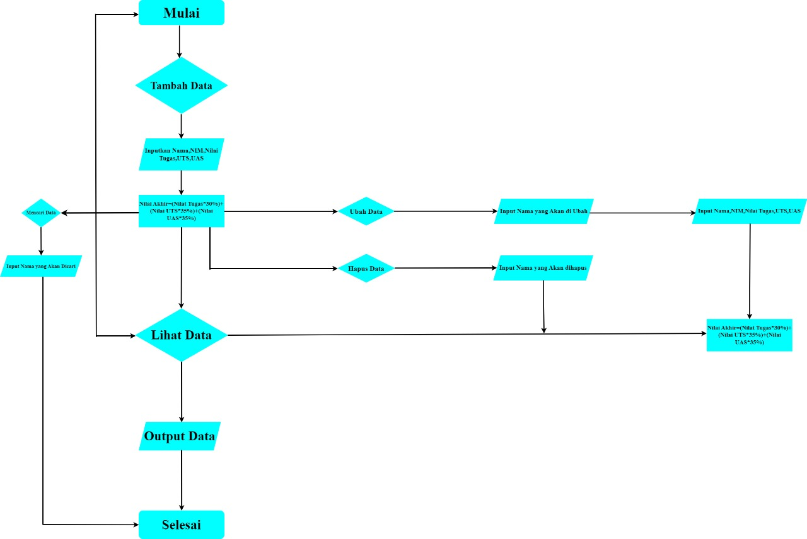

LANGKAH LANGKAH LATIHAN

Membuat dictionary daftar kontak dan kontak.
Print daftar kontak dan kontak.
Menampilkan kontak dan menampilkan kontak baru.
Mengubah kontak dengan nomor baru.
Menampilkan semua nama, nomor, daftar nama dan nomornya.
Menghapus kontak yang ingin di hapus.

LANGKAH LANGKAH PRAKTIKUM

Memasukan nilai-nilai akhir seperti tugas, UTS, dan UAS.
Menampilkan data yang berisi (NIM, Nama, Nilai Tugas, Nilai UTS, dan Nilai UAS).
Mengubah data dengan cara memasukan NIM kembali.
Jika ingin menghapus data maka masukan NIM yang akan di hapus.
Mencari data, dengan cara memasukan NIM yang akan di cari.
Else Blok kode dibawah else akan dijalankan jika semua kondisi dalam if dan elif sebelumnya bernilai False.

# LATIHAN
.png)
.png)
.png)

# PRAKTIKUM
.png)
.png)
.png)
.png)
.png)

